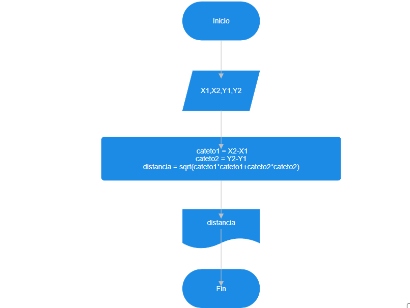
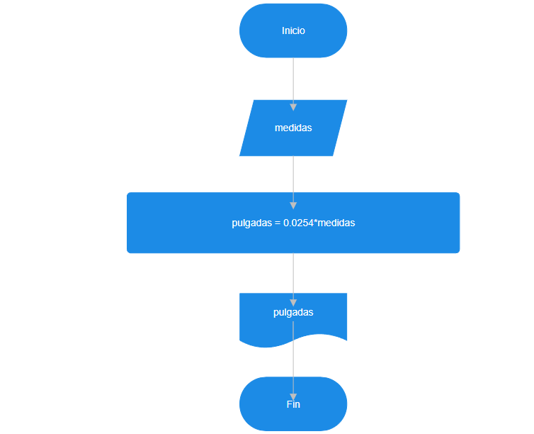
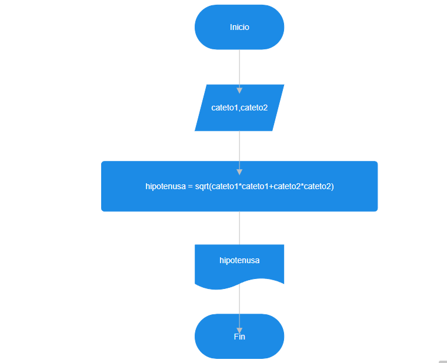

# Ejercicios

1) solicitar al usuario 2 numeros enteros, imprimir en pantalla los numeros pares comprendidos entre ellos.

```
Inicio
Escribir "ingrese un numero entero: "
leer N1
Escribir "ingrese un numero entero: "
leer N2
si N1 < N2:
    mayor = N2
    menor = N1
si no
    mayor = N1
    menor = N2
fin si
mientras menor <= mayor:
    si residuo(menor, 2) = 0
        escribir residuo
    fin si
    menor = menor + 1
Fin
```

2) Serie de fibonacci

0 1 1 2 3 5 8 13 21 34 55...

```
Inicio
Escribir "¿cuantós números de la serie imprimir?
Leer N
cont = 0
N1 = 0
N2 = 1
escribir N1
mientras cont <= N
    N3 = N1 + N2
        escribir N3
    N1 = N2
    N2 = N3
    cont = cont + 1
Fin
```

# Problemas

1) Se requiere obtener la distancia entre dos puntos en el plano cartesiano. Realice un diagrama de flujo y pseudocódigo que representen el algoritmo para obtener la distancia entre esos puntos.

```
Inicio 
Escribir " ingrese las coordenadas X1,X2,Y1,Y2:"
Leer X1,X2,Y1,Y2   
cateto1 = X2-X1
cateto2 = Y2-Y1
distancia = sqrt(cateto1*cateto1+cateto2*cateto2)
escribir distancia
Fin
```



2) Una modista, para realizar sus prendas de vestir, encarga las telas al extranjero.
Para cada pedido, tiene que proporcionar las medidas de la tela
en pulgadas, pero ella generalmente las tiene en metros. Realice un algoritmo
para ayudar a resolver el problema, determinando cuántas pulgadas
debe pedir con base en los metros que requiere. (1 pulgada = 0.0254 m).

```
Inicio
escriba "ingrese las medidas de la tela: "
leer medidas
pulgadas = 0.0254*medidas
escriba " las medidas de la tele son", pulgadas
Fin
```


3) Se requiere determinar la hipotenusa de un triángulo rectángulo. ¿Cómo sería el diagrama de flujo y el pseudocódigo que representen el algoritmo para obtenerla? 

```
Inicio
Escriba "ingrese los catetos del triangulo rectangulo: "
leer cateto1,cateto2
hipotenusa = sqrt(cateto1*cateto1+cateto2*cateto2)
escribir " la hipotenusa del triangulo es", hipotenusa
Fin
```


4) Se requiere determinar la edad actual de una persona basándose en su fecha de nacimiento. Además, es necesario establecer si la persona ya ha cumplido años en el año en curso, si aún no lo ha hecho, o si hoy es su cumpleaños, para celebrarlo. La fecha de nacimiento y la fecha actual estarán representadas mediante tres variables: día, mes y año.

```
Inicio
año_actual = 2025
mes_actual = 2
dia_actual = 25
escriba "ingrese su año,mes,dia de nacimiento: "
leer año,mes,dia
edad_años = año_actual - año
ya_cumplio_este_año = (mes < mes_actual) o (
    mes == mes_actual y dia <= dia_actual)
si ya_cumplio_este_año
    escriba("ya cumplio este año")
si no
    edad_años -=1
fin si
hoy_cumple_años = (dia == dia_actual y mes == mes_actual)
si hoy_cumple_años:
    escriba("Feliz Cumpleaños")
fin si
escriba("su edad es {edad_años} años")
Fin
```

5) Realice un algoritmo que permita determinar el sueldo semanal de un trabajador con base en las horas trabajadas y el pago por hora, considerando que a partir de la hora número 41 y hasta la 45, cada hora se le paga el doble, de la hora 46 a la 50, el triple, y que trabajar
más de 50 horas no está permitido. Represente el algoritmo mediante pseudocódigo.

```
Inicio
escriba("ingrese las horas trabajadas: ")
escriba("ingrese el pago por hora: ")
leer pago_hora,horas_trabajadas
si horas_trabajadas < 41
    horas_trabajadas = horas_trabajadas*pago_hora
si no 
    si horas_trabajadas < 46
        horas_trabajadas = 2*horas_trabajadas*pago_hora
    si no
        si horas_trabajadas < 51
            horas_trabajadas = 3*horas_trabajadas*pago_hora
        si no 
            escriba("no permitido trabajar mas de 50 horas")
fin si
escriba("el sueldo semanal es de: {horas_trabajadas}")
Fin
```

6) Se requiere un algoritmo para determinar, de N cantidades, cuántas son cero, cuántas son menores a cero, y cuántas son mayores a cero. Realice el pseudocódigo para representarlo, utilizando el ciclo apropiado.

```
Inicio
escriba("ingrese la cantidad de numeros a evaluar: ")
leer n_num
cont = 1
contador_negativo = 0
contador_positivo = 0
contador_cero = 0
mientras cont <= n_num:
    escriba("ingrese un numero: ")
    leer num
    si num == 0:
        contador_cero = contador_cero + 1
        cont += 1
    si no
        si num < 0:
            contador_negativo = contador_negativo + 1
            cont += 1
        si no
            num > 0
            contador_positivo = contador_positivo + 1
            cont += 1
    fin si
fin mientras
escriba("los numeros iguales a 0 son: {contador_cero}")
escriba("los numeros menores a 0 son: {contador_negativo}")
escriba("los numeros mayores a 0 son: {contador_positivo}")
Fin
```

7) Se requiere un algoritmo para determinar cuánto ahorrará en pesos una persona diariamente, y en un año, si ahorra 3¢ el primero de enero, 9¢ el dos de enero, 27¢ el 3 de enero y así sucesivamente todo el año. Represente la solución mediante pseudocódigo.

```
Inicio
ahorro_inicial = 3
ahorro_diario = 0
cont = 1
dia = 1
mientras cont <= 366:
    ahorro_diario = ahorro_inicial
    escriba("el ahorro el dia {dia} es de {ahorro_diario}¢")
    ahorro_inicial *=3
    dia +=1
    cont +=1
fin mientras
Fin
```

8) Realice el algoritmo para determinar cuánto pagará una persona que adquiere N artículos, los cuales están de promoción. Considere que si su precio es mayor o igual a $200 se le aplica un descuento de 15%, y si su precio es mayor a $100, pero menor a $200, el descuento es de
12%; de lo contrario, solo se le aplica 10%. Se debe saber cuál es el costo y el descuento que tendrá cada uno de los artículos y finalmente cuánto se pagará por todos los artículos obtenidos. Represente la solución mediante pseudocódigo.

```
Inicio
escriba("ingrese el numero de articulos: ")
leer num_art
cont = 1
costo_total = 0
mientras cont <= num_art:
    escriba("ingrese el costo del articulo: ")
    leer art
    si art >= 200:
        costo = art-art*0.15
        cont +=1
        print(f"el costo del articulo es de {costo} con un descuento del 15%")
        costo_total += costo
    si no
        si art > 100:
            costo = art-art*0.12
            cont +=1
            print(f"el costo del articulo es de {costo} con un descuento del 12%")
            costo_total += costo
        si no
            costo = art-art*0.10
            cont +=1
            print(f"el costo del articulo es de {costo} con un descuento del 10%")
            costo_total += costo
    fin si
fin mientras
escriba("El costo total por todos los articulos es de {costo_total}")
Fin
```

9) Realice un algoritmo y represéntelo mediante pseudocódigo para obtener una función exponencial, la cual está dada por:
    
    $𝑒^𝑥 = 1+\frac x {1!} + \frac {x^2}{2!}+ \frac {x^3}{3!}+ …$

```
Inicio
escriba("ingrese el valor de la exponente: ")
escriba("ingrese cuantas datos desea realizar sumar: ")
leer x_valor, num_evaluar
cont = 1
exponencial = 1
factorial = 1
resultado = 1
mientras cont <= num_evaluar:
    exponencial *= x_valor
    factorial *= cont
    resultado = resultado + (exponencial/factorial)
    cont +=1
fin mientras
escriba(resultado)
Fin
```

10) Realice un algoritmo para obtener el seno de un ángulo y represéntelo mediante pseudocódigo. Utilice la siguiente ecuación:

$Sen x = x - \frac{x^3}{3!} + \frac{x^5}{5!} - \frac{x^7}{7!} + ...$

```
Inicio
escriba("Ingrese el seno en grados: ")
escriba("Ingrese cuántos términos desea sumar: ")
leer x_valor, num_evaluar
x_rad = x_valor * (pi / 180)
cont = 1
exponencial = 1
seno = 0
signo = 1
factorial = 1
mientras cont <= num_evaluar:
    si cont > 1:
        factorial = factorial * exponencial * (exponencial - 1)
    fin si
    término = (x_rad ** exponencial) / factorial
    seno = seno + (signo * término)
    signo = signo * -1
    exponencial = exponencial + 2
    cont += 1
fin mientras
escriba("El seno de {x_valor} es: {seno}")
Fin
```